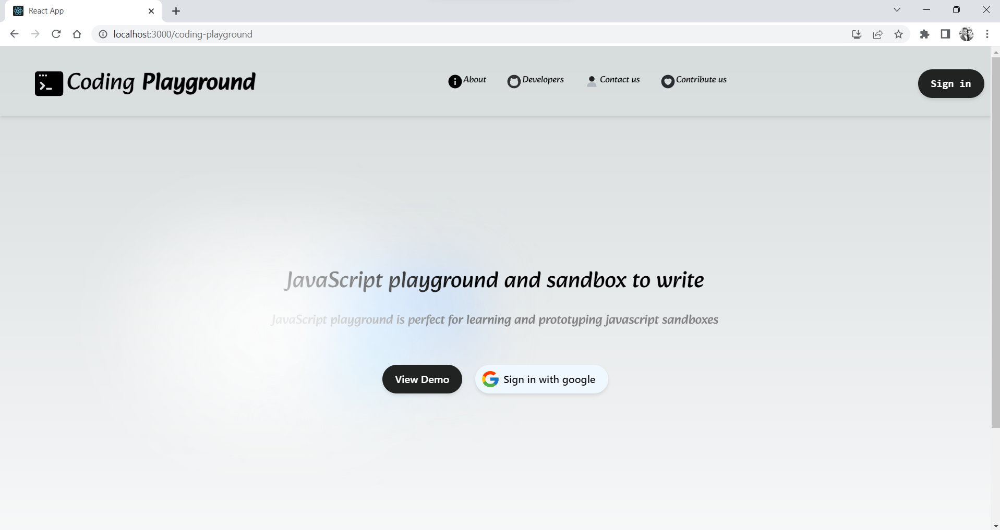
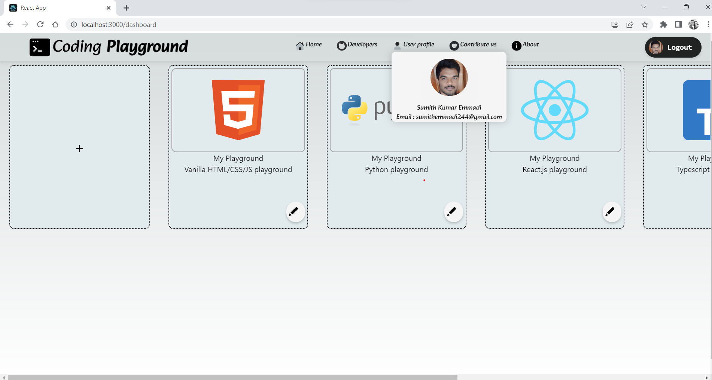
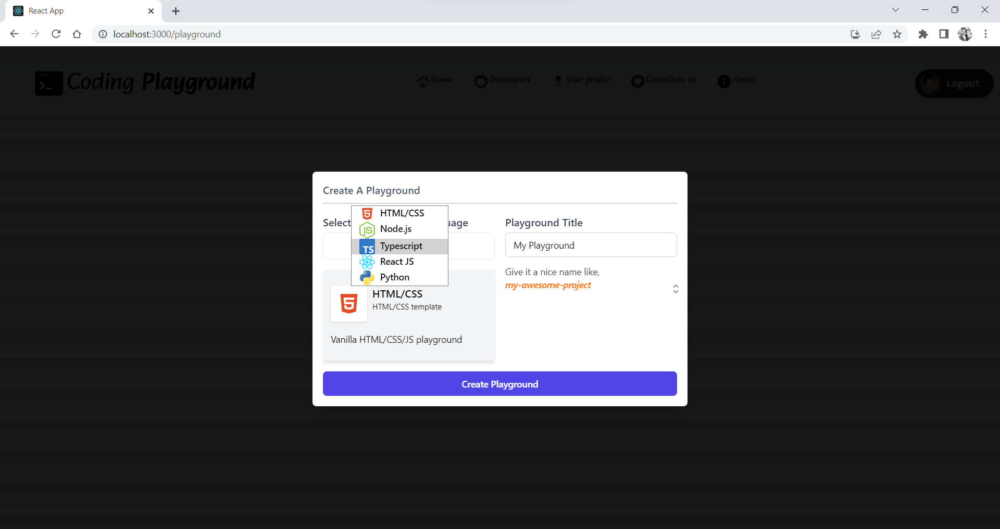
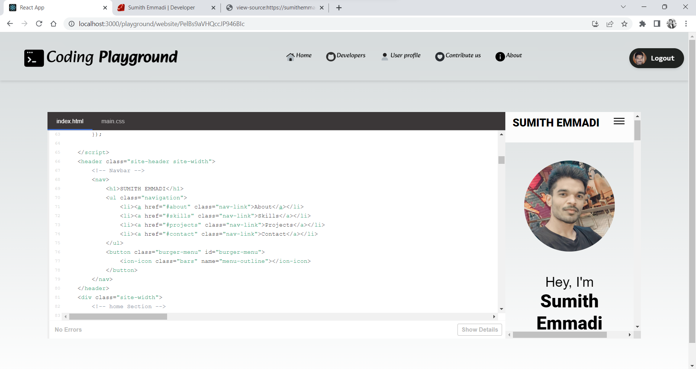

# Coding Playground

Coding Playground is a online coding text editor which support 'HTML','CSS','Javascript','Typescript','ReactJS' and 'Python'. 

# Requirements

1. `Node.js` => v18.16.0
2. `npm`  => 9.6.5
3. `MongoDB` => 7.0.4
4. `Firebase` => 9.20.0

# Installation

1. Go to the frontend directory and backend directory.
2. And run below command in both the directories

```sh
~$ npm install 
```

# Start React App

1. First start the backend before starting frntend.
2. Go to backend directory and run `npm start`
3. And now go to the frontend directory to start the front end.
4. Run `npm start` command to start backend.

> **Note** : Frontend will start on port 3000 and can be accessable from here https://localhost:3000 and backend will start on port 5000 and can be accessable from here https://localhost:5000/api/getAll .

- homepage

<br>

- dashboard

<br>

- form

<br>

- demo

<br>


